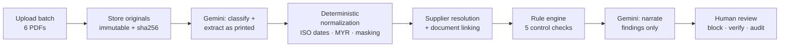

# VendorGuard AI

AI-powered financial report analysis for accounts-payable fraud detection — built for **DevLeague 2026, Lab 1: Digital Transformation & Operations** (sponsored by Experian).

**🔗 Live demo: https://vendorguard-dongqing-gengs-projects.vercel.app** · [Dashboard](https://vendorguard-dongqing-gengs-projects.vercel.app/dashboard)

A finance analyst uploads a batch of financial PDFs (supplier profile, purchase order, invoices, delivery order, payment receipt). The system classifies and extracts each document, normalizes the fields, links them into a single transaction, runs deterministic control checks, and produces an explainable risk score with evidence citations — routing high-risk cases to human review.

## How It Works

1. **Upload & store** — PDFs are stored as immutable originals, each with its own document ID.
2. **Classify** — each PDF is identified by type (supplier profile, PO, invoice, delivery order, receipt).
3. **Extract & normalize** — ISO dates, MYR decimal amounts, canonical supplier keys, normalized references, and masked bank accounts (e.g. `********4321`).
4. **Link** — documents are resolved to one supplier and connected into a single transaction via references, amounts, and dates.
5. **Detect** — deterministic rule checks (duplicate invoice, bank-account mismatch, payment-status conflict, missing PO reference, overdue invoice) produce an additive risk score.
6. **Explain** — every finding cites the exact source documents and fields it was derived from.
7. **Review** — high-risk transactions require human action: block payment, request bank verification, with a full audit trail.

The AI layer handles extraction, classification, and explanation. Risk findings come from **deterministic rules over normalized fields** — never LLM guesses — which is what makes every insight auditable and transparent.

## Architecture



- **Next.js 16** (App Router) — UI and API routes; all data access is server-side
- **Supabase** — Postgres (RLS deny-by-default) + private storage bucket for originals
- **Gemini** — classification, field extraction, and explanation narration only; the risk score itself is pure code (`src/lib/rules.ts`), so identical inputs always produce identical findings, each citing its source documents

## Privacy & PDPA Compliance

- Only data needed for the analysis is processed.
- PII (bank account numbers, personal details) is masked at the normalization stage, before anything is displayed.
- Users control their uploaded data, including retention and deletion.
- Data usage and protection are communicated clearly in the app.

## Tech Stack

- **[Next.js](https://nextjs.org)** — App Router frontend and API routes (upload flow, dashboard, review actions)
- **[Supabase](https://supabase.com)** — Postgres database, file storage for original PDFs, and auth
- **[Gemini](https://ai.google.dev)** — document extraction, classification, and explanations
- **[Vercel](https://vercel.com)** — hosting and deployment

## Getting Started

```bash
# Install dependencies
npm install

# Run the dev server at http://localhost:3000
npm run dev
```

Other commands: `npm run build` (production build), `npm run lint` (ESLint).

Copy `.env.example` to `.env.local` and fill in the secrets:

| Variable | Description |
| --- | --- |
| `NEXT_PUBLIC_SUPABASE_URL` | Supabase project URL |
| `NEXT_PUBLIC_SUPABASE_PUBLISHABLE_KEY` | Supabase publishable key (safe for the browser) |
| `SUPABASE_SECRET_KEY` | Server-only secret key — all DB/storage access goes through the server |
| `GEMINI_API_KEY` | Gemini API key — document extraction, classification, and explanations |

All database tables have row-level security enabled with no policies (deny by default): the browser can never read data directly, and every query runs server-side where PII is masked before rendering.

## Docs

- `docs/00_Problem_Statements.pdf` — official challenge brief and judging criteria
- `docs/01_Automation_Scenario_Guide.pdf` — the six-PDF demo scenario the system must pass, including expected findings and the 70/100 risk score
