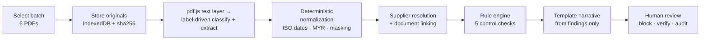

# VendorGuard AI

Explainable accounts-payable fraud detection over financial PDFs — built for **DevLeague 2026, Lab 1: Digital Transformation & Operations** (sponsored by Experian).

**🔗 Live demo: https://vendorguard-dun.vercel.app** · [Dashboard](https://vendorguard-dun.vercel.app/dashboard) · try it with the six PDFs in [`samples/`](samples/)

> **Project status:** the hackathon has ended and the project is archived in a self-contained form. The whole pipeline now runs **in the browser** — no database, no AI API, no server, no secrets. It is a static site that can be hosted anywhere. The original hackathon build (Supabase + Gemini) is preserved in git history up to commit `cb60b7a`.

A finance analyst selects a batch of financial PDFs (supplier profile, purchase order, invoices, delivery order, payment receipt). The system classifies and extracts each document, normalizes the fields, links them into a single transaction, runs deterministic control checks, and produces an explainable risk score with evidence citations — routing high-risk cases to human review.

## How It Works

1. **Store** — PDFs are hashed (SHA-256) and kept as immutable originals in the browser's IndexedDB, each with its own document ID.
2. **Classify** — each PDF is identified by type (supplier profile, PO, invoice, delivery order, receipt) from its title and field labels.
3. **Extract & normalize** — fields are read from the PDF text layer as printed, then normalized: ISO dates, MYR decimal amounts, canonical supplier keys, normalized references, and masked bank accounts (e.g. `********4321`).
4. **Link** — documents are resolved to one supplier and connected into a single transaction via references, amounts, and dates.
5. **Detect** — deterministic rule checks (duplicate invoice, bank-account mismatch, payment-status conflict, missing PO reference, overdue invoice) produce an additive risk score.
6. **Explain** — every finding cites the exact source documents and fields it was derived from, and a template renders them as a plain-language narrative.
7. **Review** — high-risk transactions require human action: block payment, request bank verification, with a full audit trail.

Risk findings come from **deterministic rules over normalized fields** — never model guesses — which is what makes every insight auditable and transparent. The archived build takes this one step further: extraction and narration are deterministic too, so the same six PDFs always produce byte-identical output.

## Architecture



Everything above runs client-side (`src/lib/pipeline.ts`); the site is a Next.js static export.

- `src/lib/db.ts` — IndexedDB store mirroring the original Postgres schema (batches, documents, files, suppliers, transactions, findings, audit events)
- `src/lib/extract-local.ts` — label-driven classification and field extraction over the pdf.js text layer; handles the common Malaysian AP document vocabulary and returns `null` rather than guessing for unknown layouts (scanned PDFs without a text layer classify as `unknown`)
- `src/lib/rules.ts` — the five control checks; pure code, so identical inputs always produce identical findings, each citing its source documents
- `src/lib/explain-local.ts` — deterministic narrative template over the rule output

During the hackathon the classify/extract and narration boxes were Gemini calls and storage was Supabase; that build is at commit `cb60b7a`.

## Privacy & PDPA Compliance

- Nothing leaves the device: PDFs, extracted fields, findings and the audit log live in the browser's IndexedDB. There is no upload, no server, and no third-party API call.
- Only the fields needed for the control checks are read from each PDF.
- Bank account numbers are masked at the normalization stage (`********4321`); the full number is never persisted or displayed.
- Users control retention: delete any batch (leaving only a deletion audit record) or erase everything from the dashboard.
- Data handling is explained on the upload page.

## Tech Stack

- **[Next.js 16](https://nextjs.org)** — App Router, static export (`output: "export"`)
- **[pdf.js](https://mozilla.github.io/pdf.js/)** — PDF text-layer extraction in a Web Worker
- **IndexedDB** — browser-local persistence, no library
- **[Vercel](https://vercel.com)** — static hosting (any static host works)

## Getting Started

```bash
# Install dependencies
npm install

# Run the dev server at http://localhost:3000
npm run dev
```

Other commands: `npm run build` (static export to `out/`), `npm run lint` (ESLint), `npx tsx scripts/verify-local-pipeline.ts` (runs extraction + rules over `samples/` and asserts the expected 5 findings / 70 score).

No environment variables or accounts are needed.

## Docs

- `docs/00_Problem_Statements.pdf` — official challenge brief and judging criteria
- `docs/01_Automation_Scenario_Guide.pdf` — the six-PDF demo scenario the system must pass, including expected findings and the 70/100 risk score
